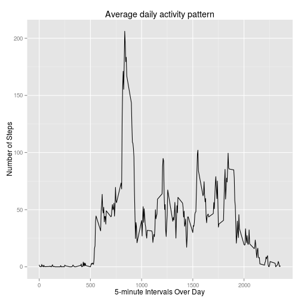
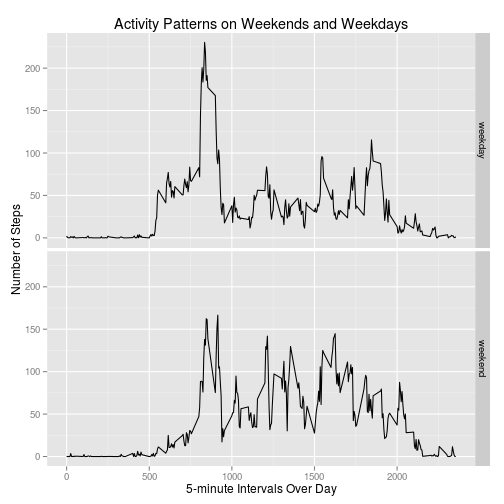

## Prerequisites

```r
library(ggplot2)
Sys.setlocale("LC_ALL", 'en_US.UTF-8') # important, because my OS isn't in English
```

## Loading and preprocessing the data

```r
if(!file.exists("activity.zip")){
  download.file("https://d396qusza40orc.cloudfront.net/repdata%2Fdata%2Factivity.zip", destfile="activity.zip")
}

if(!file.exists("activity.csv")){
  unzip("activity.zip")
}

original_data <- read.csv("activity.csv")
original_data$date <- as.Date(original_data$date)
data_without_na <- na.omit(original_data)

summary(original_data)
```

```
##      steps             date               interval     
##  Min.   :  0.00   Min.   :2012-10-01   Min.   :   0.0  
##  1st Qu.:  0.00   1st Qu.:2012-10-16   1st Qu.: 588.8  
##  Median :  0.00   Median :2012-10-31   Median :1177.5  
##  Mean   : 37.38   Mean   :2012-10-31   Mean   :1177.5  
##  3rd Qu.: 12.00   3rd Qu.:2012-11-15   3rd Qu.:1766.2  
##  Max.   :806.00   Max.   :2012-11-30   Max.   :2355.0  
##  NA's   :2304
```

## What is mean total number of steps taken per day?

For this part, ignore the missing values in the dataset.

* Make a histogram of the total number of steps taken each day


```r
total_steps_per_day <- aggregate(steps ~ date, data = data_without_na, sum)
hist(total_steps_per_day$steps, main = "Histogram of the total number of steps taken each day", xlab = "Total number of steps taken each day")
```

 

* Calculate and report the **mean** and **median** total number of steps taken per day


```r
mean(total_steps_per_day$steps)
```

```
## [1] 10766.19
```

```r
median(total_steps_per_day$steps)
```

```
## [1] 10765
```


## What is the average daily activity pattern?

* Make a time series plot (i.e. type = "l") of the 5-minute interval (x-axis) and the average number of steps taken, averaged across all days (y-axis)


```r
average_steps_per_interval <- aggregate(steps ~ interval, data = data_without_na, mean)

ggplot(average_steps_per_interval, aes(interval, steps)) + geom_line() +
  labs(title="Average daily activity pattern",
       x="5-minute Intervals Over Day", y="Number of Steps")
```

 

* Which 5-minute interval, on average across all the days in the dataset, contains the maximum number of steps?


```r
average_steps_per_interval[which.max(average_steps_per_interval$steps), ]
```

```
##     interval    steps
## 104      835 206.1698
```


## Imputing missing values


Note that there are a number of days/intervals where there are missing values (coded as NA). The presence of missing days may introduce bias into some calculations or summaries of the data.

* Calculate and report the total number of missing values in the dataset (i.e. the total number of rows with NAs)


```r
# summary(original_data) # also shows that information
sum(is.na(original_data$steps))
```

```
## [1] 2304
```

* Devise a strategy for filling in all of the missing values in the dataset. The strategy does not need to be sophisticated. For example, you could use the mean/median for that day, or the mean for that 5-minute interval, etc.

The strategy is to replace missing values by the mean for that 5-minute interval:


```r
imput_mean_steps <- function(interval) {
  return(average_steps_per_interval[average_steps_per_interval$interval == interval, "steps"])
}
```


* Create a new dataset that is equal to the original dataset but with the missing data filled in.


```r
imputed_data <- original_data
for (i in 1:nrow(imputed_data)) {
  if (is.na(imputed_data$steps[i])) {
    imputed_data$steps[i] <- imput_mean_steps(imputed_data$interval[i])
  }
}

summary(imputed_data)
```

```
##      steps             date               interval     
##  Min.   :  0.00   Min.   :2012-10-01   Min.   :   0.0  
##  1st Qu.:  0.00   1st Qu.:2012-10-16   1st Qu.: 588.8  
##  Median :  0.00   Median :2012-10-31   Median :1177.5  
##  Mean   : 37.38   Mean   :2012-10-31   Mean   :1177.5  
##  3rd Qu.: 27.00   3rd Qu.:2012-11-15   3rd Qu.:1766.2  
##  Max.   :806.00   Max.   :2012-11-30   Max.   :2355.0
```

* Make a histogram of the total number of steps taken each day.


```r
total_steps_imputed_data <- aggregate(steps ~ date, data = imputed_data, sum)
hist(total_steps_imputed_data$steps, main = "Histogram of the total number of steps taken each day", xlab = "Total number of steps taken each day")
```

 

* Calculate and report the **mean** and **median** total number of steps taken per day. 


```r
comparative_matrix <- rbind(c(mean(total_steps_per_day$steps),
                              mean(total_steps_imputed_data$steps)),
                            c(median(total_steps_per_day$steps),
                              median(total_steps_imputed_data$steps)))

colnames(comparative_matrix) <- c("Old data","New data")
rownames(comparative_matrix) <- c("Mean","Median")

comparative_matrix
```

```
##        Old data New data
## Mean   10766.19 10766.19
## Median 10765.00 10766.19
```

* Do these values differ from the estimates from the first part of the assignment? What is the impact of imputing missing data on the estimates of the total daily number of steps?

The missing data have a small, almost zero impact.

```r
mean(total_steps_per_day$steps) - mean(total_steps_imputed_data$steps)
```

```
## [1] 0
```

```r
median(total_steps_per_day$steps) - median(total_steps_imputed_data$steps)
```

```
## [1] -1.188679
```

## Are there differences in activity patterns between weekdays and weekends?

For this part the weekdays() function may be of some help here. Use the dataset with the filled-in missing values for this part.

* Create a new factor variable in the dataset with two levels – “weekday” and “weekend” indicating whether a given date is a weekday or weekend day.


```r
imputed_data <- transform(imputed_data, daytype = ifelse(weekdays(imputed_data$date) %in% c("Sunday", "Saturday"), "weekend", "weekday"))
```

* Make a panel plot containing a time series plot (i.e. type = "l") of the 5-minute interval (x-axis) and the average number of steps taken, averaged across all weekday days or weekend days (y-axis).


```r
average_per_weekdays <- aggregate(steps ~ interval + daytype, data = imputed_data, mean)

ggplot(average_per_weekdays, aes(interval, steps)) +
  geom_line() + facet_grid(daytype ~ .) +
  labs(title="Activity Patterns on Weekends and Weekdays",
       x="5-minute Intervals Over Day", y="Number of Steps")
```

 
